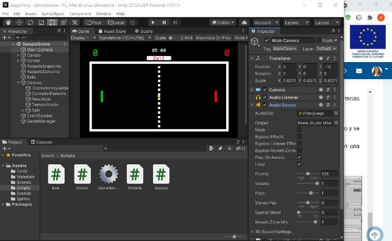
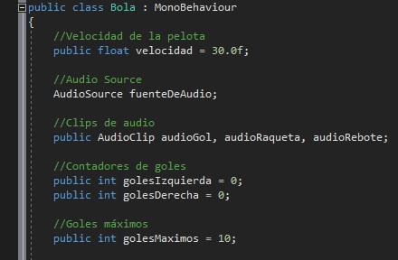

Para hacer el juego de Pong me he basado el Tutorial <https://www.jairogarciarincon.com/clase/unity-videojuego-para-2-jugadores-en-2d-estilo-pong/introduccion>

`  `He realizado algunas mejoras de tipo estético como puede ser añadir un color para cada raqueta y marcador  de goles, tambien he añadido música durante todo el juego

`  `He añadido también algunas funcionalidades como puede ser una variable con los goles máximo en mi casi 10, que la partida dure como máximo  5 minuto se que se pueda salir del juego con la tecla ESC.

